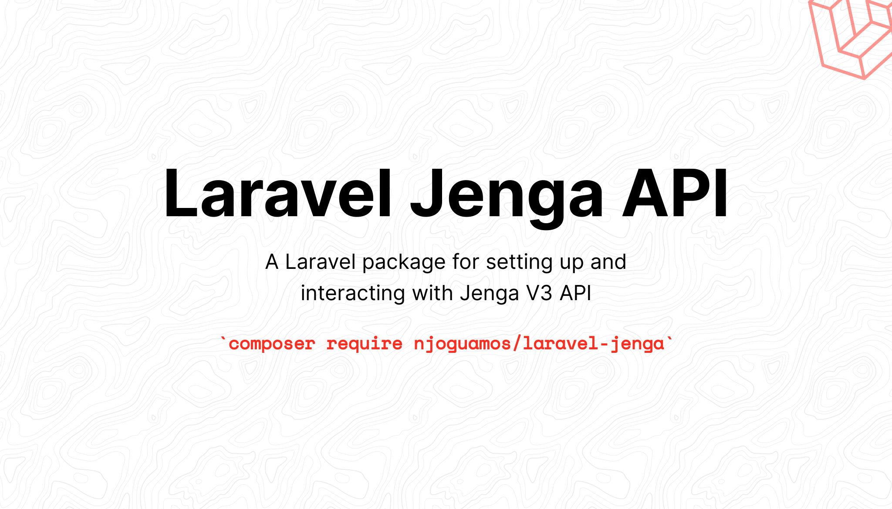

> **Warning**
> This package is still in development and is not production ready. Use for testing and development.
>


# Jenga API wrapper for Laravel
[](https://github.com/njoguamos/laravel-jenga/actions/workflows/run-test.yml)
[](https://github.com/njoguamos/laravel-jenga)
[](https://packagist.org/packages/njoguamos/laravel-jenga)


## Why use this package
1. To automate generation of jenga api `Bearer Token`
2. To provide a way of generating jenga api `access_token` which normally expires after a particular period
3. To provide a fluent way of generating jenga api key pair of `private key` and `public key`
4. Offer a seamless gateway to interacting with Jenga API

## Documentation


### 1. Installing and Setting up the Package
#### 1.1 Installation

Use the Composer package manager to install this package into your Laravel project

```bash
composer require njoguamos/laravel-jenga
```

#### 1.2 Update your `.env` variables

This package assumes that you have [registered for a JengaHQ](https://v3.jengahq.io/registration) account, and that you have `Api Key`, `Merchant Code` and `Consumer Secret` from Jenga.

Copy the respective keys and place them in the `.env` as show in the example below.

```dotenv
JENGA_API_KEY=i+FnsiJlFQANDLIZQiuiUxHuSAuQFB7lq/zyWr1nmrTXZzlcicyk3pz6HyqB+PGt/dB+tqPw4VTT3VUQik5+0w==
JENGA_CONSUMER_SECRET=905bo1ZaUZsaX44wkR51C8Ka9qLQTx
JENGA_MERCHANT_CODE=0123456789
```

> **Info**
> If you don't have the credentials, follow the [developer quickstart](https://developer.jengaapi.io/docs/developer-quickstart) from Jenga API documentation.

#### 1.3 Initialising the Package

Before you can use the package, run the initialisation command:

```bash
php artisan jenga:install
```

This command will allow you to:
- publish the `jenga.php` config file
- publish the `create_jenga_tokens` migration
- run migrations (optional)

> **Info**
> For security reasons, `access_token` and `refresh_token` will be encrypted using you `application key`. You can learn more about encryption from [Laravel documentation](https://laravel.com/docs/9.x/encryption)

### 1.4 Generating `Bearer Token`

Once you have valid credentials, run the following command.

```bash
php artisan jenga:auth
```

This command will get an `access_token` token from Jenga API and add them into a new record on `jenga` table.

This command may fail:
- When you are not connected to the internet
- When `Api Key` or `Consumer Secret` or `Merchant` is/are invalid.

#### 1.5 Generate `Bearer Token` Frequently
The generated `access_token` expires after a particular period usually after `one hour`. To generate a new `access_token` automatically, schedule the `jenga:auth` command in the console kernel. The schedule time should be less than one hour.

```php
// app/Console/Kernel.php
protected function schedule(Schedule $schedule)
{
    ...
    $schedule->command('jenga:auth')->everyThirtyMinutes();
    ...
}
```

#### 1.6 Generate Signature

- [ ] TODO: document


## 2. Usage
### 2.1 Account services
- [ ] Account Balance
- [ ] Account MINI Statement
- [ ] Account Full Statement
- [ ] Opening and Closing Account Balance
- [ ] Account Inquiry - Bank Accounts

### 2.1 Send money
- [ ] Within Equity Bank
- [ ] To Mobile Wallets
- [ ] Real Time Gross Settlement (RTGS)
- [ ] Society for Worldwide Interbank Financial Telecommunication (SWIFT)
- [ ] Pesalink - To Bank Account
- [ ] Pesalink - To Mobile Number

### 2.1 Send money - IMT
- [ ] IMT Within Equity Bank
- [ ] IMT to Mobile Wallets
- [ ] IMT Pesalink - To Bank Account
- [ ] IMT Pesalink - To Bank Mobile

### 2.1 Receive money
- [ ] Receive Payments - Bill Payments
- [ ] Receive Payments - Merchant Payments
- [ ] Bill Validation

### 2.1 Receive money queries
- [ ] Get All EazzyPay Merchants
- [ ] Query Transaction Details
- [ ] Get All Billers

### 2.1 Airtime
- [ ] Purchase Airtime

### 2.1 Forex rates
- [ ] Get Forex Rates

### 2.1 Know your customer
- [ ] ID Search & Verification

### 2.1 MPGS direct integration
- [ ] MPGS Validate Payment
- [ ] MPGS Authenticate Payment
- [ ] MPGS Authorize Payment
- [ ] MPGS Query Payment
- [ ] MPGS Refund Payment


## Testing

``` bash
composer test
```

## Changelog

Please see [CHANGELOG](CHANGELOG.md) for more information what has changed recently.

## Contributing

Please see [CONTRIBUTING](CONTRIBUTING.md) for details.

## Security

If you discover any security related issues, please email njoguamos@gmail.com instead of using the issue tracker.

## Credits

- [Njogu Amos](https://github.com/njoguamos)
- [All Contributors](../../contributors)

## License

The MIT License (MIT). Please see [License File](LICENSE.md) for more information.
