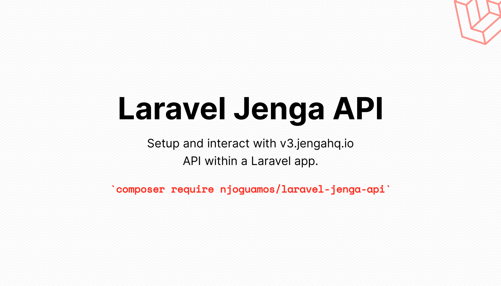

> **Warning**
> This package is still in development and is not production ready. Use for testing and development.
> 


# Jenga API wrapper for Laravel
[](https://github.com/njoguamos/laravel-jenga-api/actions/workflows/run-test.yml)
[](https://github.com/njoguamos/laravel-jenga-api)
[](https://packagist.org/packages/njoguamos/laravel-jenga-api)


## Why use this package
1. To automate generation of jenga api `Bearer Token`
2. To provide a way of generating jenga api `access_token` which normally expires after a particular period
3. To provide a fluent way of generating jenga api key pair of `private key` and `public key`
4. Offer a seamless gateway to interacting with Jenga API

## Documentation
A detailed documentation can be found at [https://njoguamos.github.io/laravel-jenga-api](https://njoguamos.github.io/laravel-jenga-api)

## Testing

``` bash
composer test
```

## Changelog

Please see [CHANGELOG](CHANGELOG.md) for more information what has changed recently.

## Contributing

Please see [CONTRIBUTING](CONTRIBUTING.md) for details.

## Security

If you discover any security related issues, please email njoguamos@gmail.com instead of using the issue tracker.

## Credits

- [Njogu Amos](https://github.com/njoguamos)
- [All Contributors](../../contributors)

## License

The MIT License (MIT). Please see [License File](LICENSE.md) for more information.
